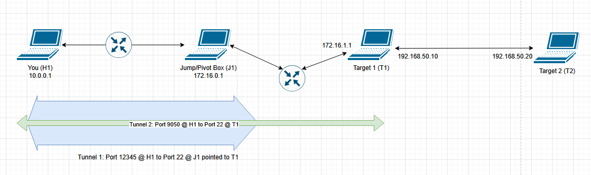

# Tunneling
Let's focus on why we use tunneling, and how to best understand usage:

## Why
Let's say we have the following setup:


In this instance, our machine (H1) only has access to J1. J1 then has access to T1 and T3, which each have further access to T2 and T4 respectively. In order to access T1-T4 from H1, we will need to tunnel.

## Usage
### Proxychains
Initial jump using a dynamic port and proxychains.
```bash
ssh J1UserName@172.16.0.1 -D 9050 -NT
```
This creates an SSH "tunnel" through J1, allowing H1 access to T1 and T3. This tunnel is utilizing port 9050 on H1 and connecting to port 22 on J1 (Default SSH).

We can access and use this tunnel by using proxychains. For example:
```bash
proxychains nmap 172.16.1.0/30
```
This would execute nmap as if we were running it FROM J1, but we are running it on H1.

### Multiple Hops
This is where it gets more complicated. For this example we will make a tunnel to T1 from H1.
To start we would need to identify the IP, so we perform the step above to create our tunnel to J1:
```bash
ssh J1UserName@172.16.0.1 -D 9050 -NT
```
At this point we use commands like `ip address` or various other tools to see other network connections or installed adapters on the device. For simplicity sake, let's assume we find connectivity to the 172.16.1.0/24 and 172.16.2.0/24 networks that T1 and T3 reside on. We would run a scan as above to identify active hosts:
```bash
proxychains nmap 172.16.1.0/24
```
This would provide us a hit on T1 with port 22 open (SSH).
Our setup would look like this:


At this point we need to end our previous dynamic tunnel and create a new tunnel:
```bash
ssh J1UserName@172.16.0.1 -L 12345:172.16.1.1:22 -NT
```
Note: The 12345 is a port that YOU define. This port is ON H1. Port 22 in this command is ON T1.
Then on H1 we run create a new dynamic tunnel:
```bash
ssh T1UserName@localhost -p 12345 -D 9050 -NT
```
In the last command you can see we are SSHing using the T1 user through port 12345 on localhost, which is connected to T1 on port 22 from the tunnel we established before it. Below is a graphical representation:

Now we have access using proxychains to see and probe T2, while maintaining an SSH connection on T1.
